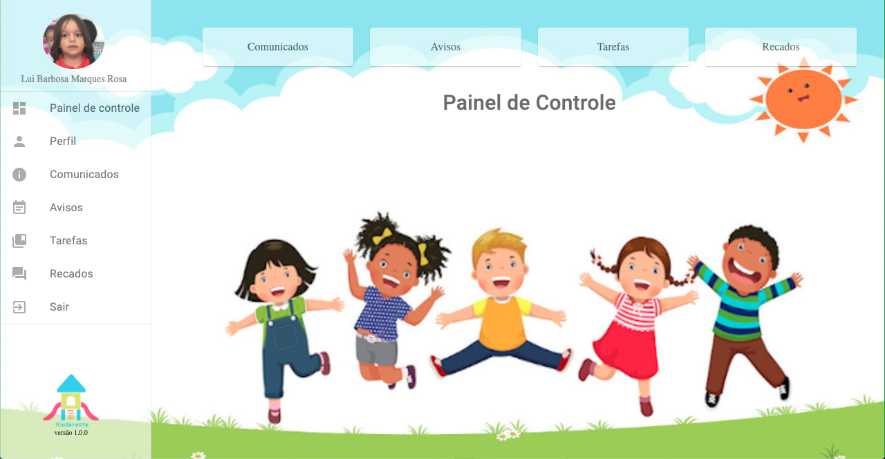

<div align="center">
    
</div>
<div align="center">
    <span style="font-size: 14px; color: #888888; padding-top: 8px; align:center">versão 1.0.0</span>
</div>

</br></br>

# Kindernote - Projeto Aplicado - IGTI
Projeto: Kindernote<br/>
Descrição: Agenda escolar infantil.


</br></br>
## :heavy_check_mark: Índice

- [Sobre](#sobre)
- [Tecnologias Utilizadas](#tecnologias-utilizadas)
- [Resultado](#resultado)
- [Como Usar](#como-usar)


</br></br>
<a id="sobre"></a>
## :bookmark: Sobre
O <strong>Kindernote</strong> é uma aplicação Web para facilitar a comunicação entre escola e pais de forma prática e ágil.


</br></br>
<a id="tecnologias-utilizadas"></a>
## :books:  Tecnologias Utilizadas

O projeto foi desenvolvido utilizando as seguintes tecnologias:

- [Node.js](https://nodejs.org/en/)
- [ReactJS](https://reactjs.org/)


</br></br>
<a id="resultado"></a>
## :computer: Resultado Web

<h1 align="center">
       
</h1>


</br></br>
<a id="como-usar"></a>
## :pencil: Como usar

- ### **Pré-requisitos**

  - É **necessário** possuir o **[Node.js](https://nodejs.org/en/)** instalado na máquina
  - Também, é **preciso** ter um gerenciador de pacotes seja o **[NPM](https://www.npmjs.com/)**.


1. Faça um clone :

```sh
  $ git clone https://github.com/marciommrs/Kindernote.git
```


2. Executando a Aplicação:

```sh

  # Instale as dependências no backend
  $ cd backend
  $ npm install
  
  # Inicie a API
  $ npm start

  # Instale as dependências no frontend
  $ cd frontend
  $ npm install

  # Inicie a aplicação frontend
  $ npm start
  
  #Acesse em http://localhost:3000/
```
